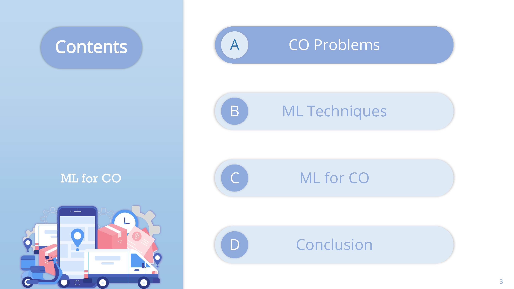
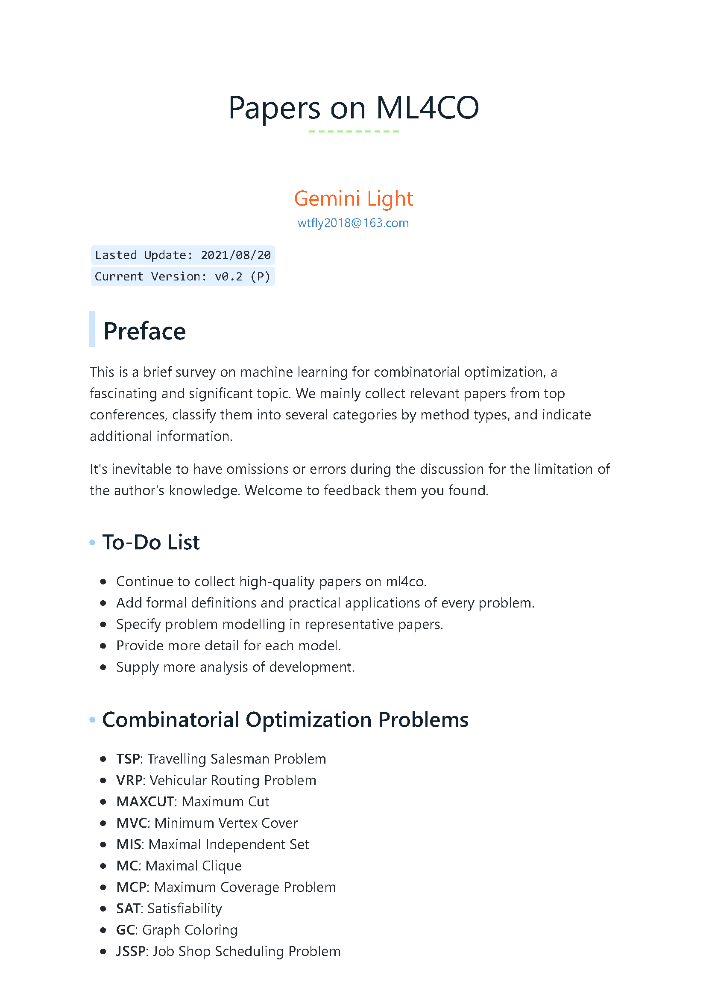
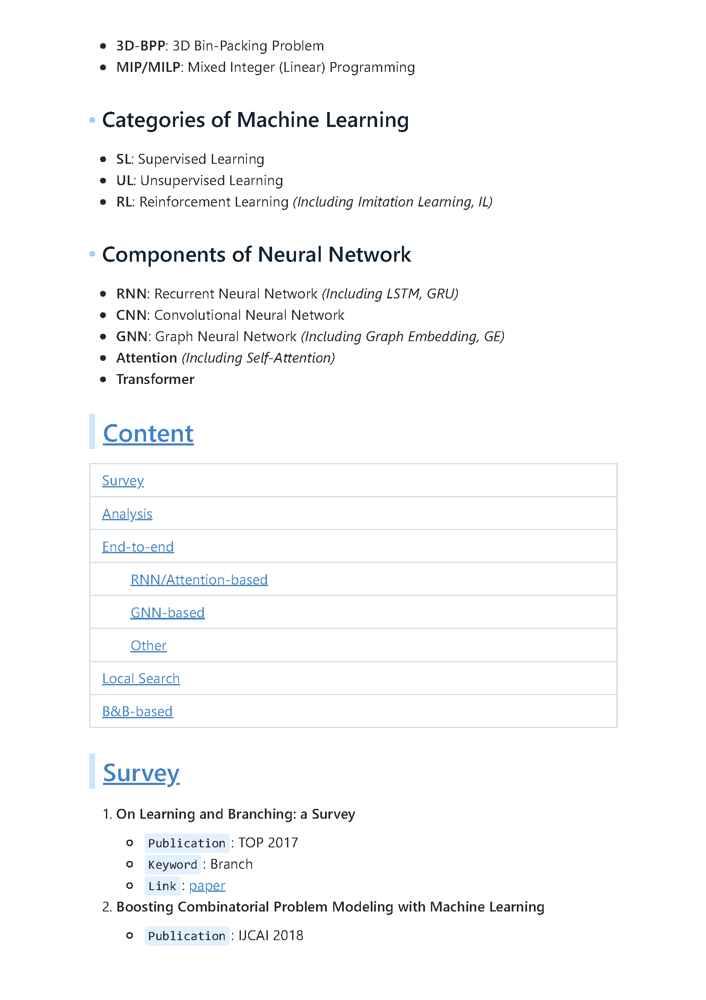

# A Survey on ML4CO

> Author: @[Gemini Light](mailto:wtfly2018@gmail.com)
> Last Update: `12/26/2021`

## Introduction

This is a brief survey on machine learning for combinatorial optimization, a fascinating and significant topic. We mainly collect relevant papers from top conferences, classify them into several categories by method types, and indicate additional information.

It's inevitable to have omissions or errors during the discussion for the limitation of the author's knowledge. Welcome to feedback them you found.

### Combinatorial Optimization Problems

- **TSP**: Travelling Salesman Problem
- **VRP**: Vehicular Routing Problem
- **MAXCUT**: Maximum Cut
- **MVC**: Minimum Vertex Cover
- **MIS**: Maximal Independent Set
- **MC**: Maximal Clique
- **MCP**: Maximum Coverage Problem
- **SAT**: Satisfiability
- **GC**: Graph Coloring
- **JSSP**: Job Shop Scheduling Problem
- **3D-BPP**: 3D Bin-Packing Problem
- **MIP/MILP**: Mixed Integer (Linear) Programming
- ......

### Categories of Machine Learning

- **SL**: Supervised Learning
- **UL**: Unsupervised Learning
- **RL**: Reinforcement Learning *(Including Imitation Learning, IL)*

### Components of Neural Network

- **RNN**: Recurrent Neural Network *(Including LSTM, GRU)*
- **CNN**: Convolutional Neural Network
- **GNN**: Graph Neural Network *(Including Graph Embedding, GE)*
  - **Attention** *(Including Self-Attention)*
- **Transformer**

## Notes

......

## [Slide](slide\ml4co-silde-geminilight-2021.09.03.pdf) [58 pages]

## [PDF](pdf/ml4co-survey.pdf) [24 pages]

## Acknowledgement

- [Awesome Machine Learning for Combinatorial Optimization Resources](https://github.com/Thinklab-SJTU/awesome-ml4co)